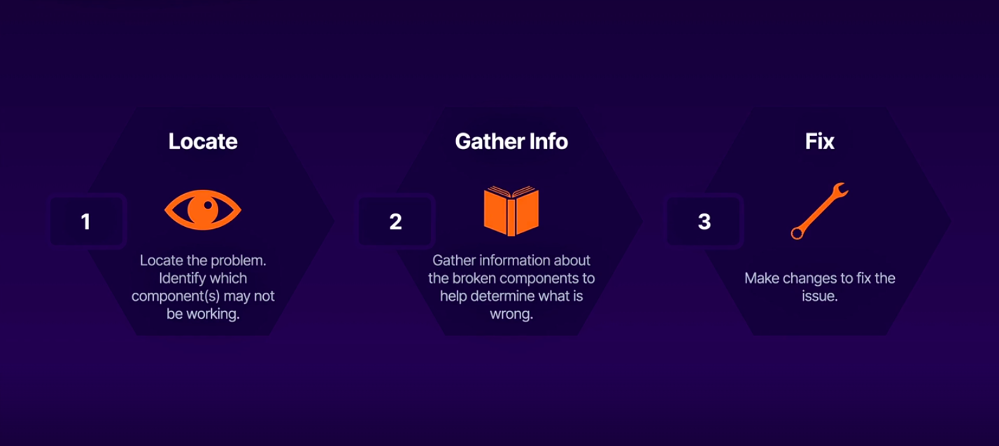

## Debugging Process


## Steps

- Check Object status kubectl get pods/deploy/.....

- Check object configuration using kubectl describe and/or view the full mainfest using kubectl get -o yaml

- Check the logs of the object

- Another thing you can do but it is not so often, you can check kube-api server logs and kubelet logs

    Check the kube-apiserver logs. Note that the log file name contains a random hash. You will need to browse the file system
    within /var/log/containers/ to find the file.

```bash
sudo cat /var/log/containers/kube-apiserver-k8s-control_kube-system_kube-apiserver-<hash>.log
```

```bash
sudo journalctl -u kubelet
```