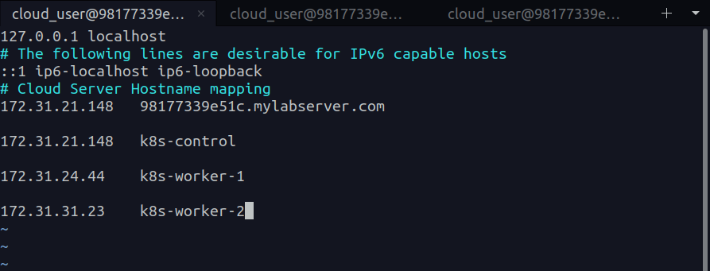

**Kubeadm:** is a tool that will simplify the process of setting up a Kubernetes cluster.

### In this hands-on tutorial we will:

- Create 3 servers (Ubuntu VMs) one of them is the control plane and the other two are worker nodes.

## Configure Servers

- SSH to the control plane server and change the hostname to be easier to identify.
```bash
sudo hostnamectl set-hostname control-plane
```
- SSH to the worker server and change the hostname to be easier to identify.
```bash
sudo hostnamectl set-hostname worker-1
```

- Setup a hosts file in control server with mapping to all of these servers so they can talk to each other.
```bash
sudo vi /etc/hosts
```
and map the servers hostnames to the IP addresses like the following. 


- Now if you logedout of the servers and do ssh again you will find the new hostname is reflected in the prompt.

### All of the upcoming steps for worker and control plane servers 

## Install COntainerd

- Load some kernel modules that are needed for containerd to work.
```bash

# Enable modules when server starts up

cat << EOF | sudo tee /etc/modules-load.d/containerd.conf
overlay
br_netfilter
EOF

sudo modprobe overlay   # immediately load the module without need to reboot

sudo modprobe br_netfilter  # immediately load the module without need to reboot
```

- Add some network configuratios
```bash
cat <<EOF | sudo tee /etc/sysctl.d/99-kubernetes-cri.conf
net.bridge.bridge-nf-call-iptables = 1
net.ipv4.ip_forward = 1
net.bridge.bridge-nf-call-ip6tables = 1
EOF

sudo sysctl --system
```

- Install containerd

```bash
sudo apt-get update && sudo apt-get install -y containerd
```

- Create configuration file for containerd
```bash
sudo mkdir -p /etc/containerd
```
- Generate a configuration file for containerd
```bash
sudo containerd config default | sudo tee /etc/containerd/config.toml
```

- Restart containerd
```bash
sudo systemctl restart containerd
```

- Disable swap as kubernetes requires that
```bash 
sudo swapoff -a
```

## Install Kubernetes

- Install some packes needed for kubernetes to work.
```bash
sudo apt-get update && sudo apt-get install -y apt-transport-https curl
```

- Install kubernetes
```bash
curl -s https://packages.cloud.google.com/apt/doc/apt-key.gpg | sudo apt-key add -

# Configure the Repository
cat << EOF | sudo tee /etc/apt/sources.list.d/kubernetes.list
deb https://apt.kubernetes.io/ kubernetes-xenial main
EOF

sudo apt-get install -y kubelet=1.24.0-00 kubeadm=1.24.0-00 kubectl=1.24.0-00

# Hold the version of kubernetes (prevent upgrades)
sudo apt-mark hold kubelet kubeadm kubectl

```

### For contorl plane server

## Initialize Kubernetes Cluster

- Initialize the cluster
pod cidr is the cidr block that will be used for pod IPs(internal communication).

```bash
sudo kubeadm init --pod-network-cidr 192.168.0.0/16 --kubernetes-version 1.24.0
```

- Configure KubeConfig in order to use kubectl from the control plane server (Interact with Cluster).
```bash
  mkdir -p $HOME/.kube
  sudo cp -i /etc/kubernetes/admin.conf $HOME/.kube/config
  sudo chown $(id -u):$(id -g) $HOME/.kube/config
```

- Install the Calico network add-on.
```bash
kubectl apply -f https://docs.projectcalico.org/manifests/calico.yaml
```

- Ltet's Join our worker nodes to the clusert, but first we need to create a token for them to join the cluster.
```bash
kubeadm token create --print-join-command
```

- Copy the output of the pervious command and run it as sudo in worker nodes

- Now run
```bash
kubectl get nods
```     


